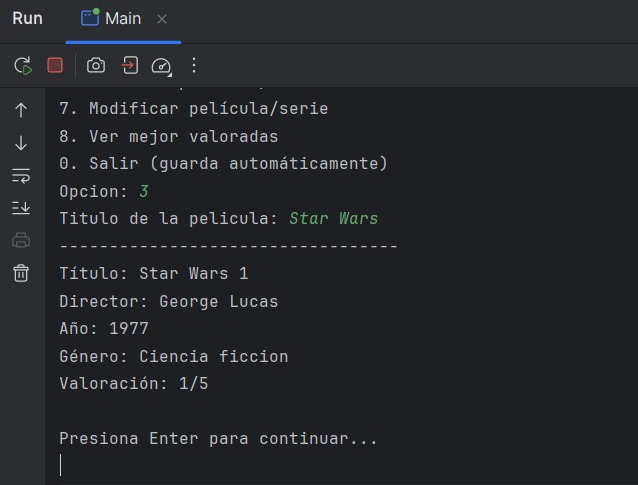
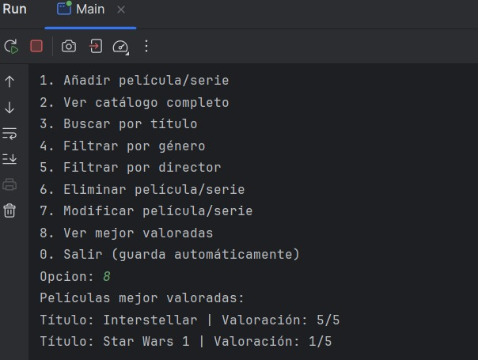

##  Catálogo de Películas y Series

###  Descripción del proyecto
Este proyecto consiste en una **aplicación en Java por consola** que permite gestionar un catálogo personal de películas y series.  
El usuario puede **añadir, ver, buscar, filtrar, modificar y eliminar películas o series**, además de **guardar y cargar automáticamente los datos** en un archivo CSV utilizando las clases `Files` y `Path`.  

El trabajo se desarrolla de forma **colaborativa en GitHub**, utilizando **Issues**, **Projects**, **ramas** y **Pull Requests** para la gestión del código y el trabajo en equipo.

---

###  Integrantes del equipo

| Integrante | Rol / Responsabilidad | Funcionalidades principales |
|-------------|------------------------|------------------------------|
| **Paul** | Añadir y visualizar contenido | `añadirPelicula()`, `verCatalogo()` |
| **Alejandro** | Buscar y eliminar contenido | `buscarPorTitulo()`, `eliminarPelicula()` |
| **Alberto** | Filtrar y modificar contenido | `filtrarPeliculasGenero()`, `filtrarPeliculasDirector()`, `modificarPeli()` |
| **Ferran** | Persistencia y documentación | `guardarCatalogo()`, `cargarCatalogo()`, `README.md` |

---

###  Funcionalidades implementadas

- [x] Añadir película/serie al catálogo  
- [x] Ver catálogo completo  
- [x] Buscar por título  
- [x] Filtrar por género  
- [x] Filtrar por director  
- [x] Eliminar película/serie  
- [x] Modificar película/serie  
- [x] Ver mejor valoradas  
- [x] Guardar automáticamente al salir  
- [x] Cargar automáticamente al iniciar  

---

###  Estructura del proyecto

```
catalogo-peliculas/
│
├── src/
│   ├── Pelicula.java
│   ├── GestorPeliculas.java
│   └── Main.java
│
├── datos/
│   └── peliculas.csv
│
└── README.md
```

---

###  Instrucciones para ejecutar la aplicación

1. **Clonar el repositorio**
   ```bash
   git clone https://github.com/tu-usuario/catalogo-peliculas.git
   cd catalogo-peliculas
   ```

2. **Compilar el proyecto**
   ```bash
   javac src/*.java
   ```

3. **Ejecutar la aplicación**
   ```bash
   java -cp src Main
   ```

---

###  Menú principal

```
========================================
 CATÁLOGO DE PELÍCULAS Y SERIES
========================================
1. Añadir película/serie
2. Ver catálogo completo
3. Buscar por título
4. Filtrar por género
5. Filtrar por director
6. Eliminar película/serie
7. Modificar película/serie
8. Ver mejor valoradas
0. Salir (guarda automáticamente)
========================================
```

---

###  Persistencia de datos

Los datos se almacenan y cargan automáticamente en el archivo:

```
datos/peliculas.csv
```

Cada línea tiene el siguiente formato:
```
Título;Director;Año;Género;Valoración
```

**Ejemplo:**
```
Inception;Christopher Nolan;2010;Ciencia Ficción;5
```

---

###  Ejemplo de uso

```
========================================
 CATÁLOGO DE PELÍCULAS Y SERIES
========================================
1. Añadir película/serie
2. Ver catálogo completo
3. Buscar por título
...
Selecciona una opción: 1
Introduce los datos de la película:
Título: Interstellar
Director: Christopher Nolan
Estreno: 2014
Género: Ciencia Ficción
Valoración: 5
Película añadida correctamente 
```

---

### 📸 Capturas de la terminal

- **Menú principal**  
  

- **Resultado de búsqueda por título**  
  

- **Películas mejor valoradas**  
  
